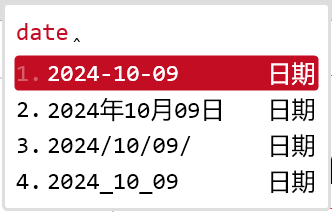
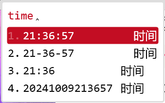
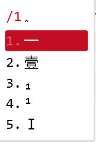
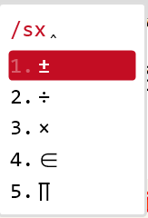
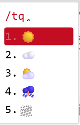
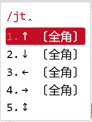
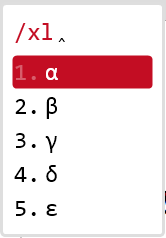

# Rime

## Install

```powershell
scoop install gendloopBucket/Rime
```

## Config

* :point_right:[个人配置](config/README.md) 
  * 中英文下均使用英文标点
  * 主题色为红色
  * 单字优先
  * `Ctrl + Shitf + Space` 切换输入法 (已包含的输入法有*五笔86*, *明月拼音*, *五笔拼音*)
  * `Ctrl + Space` 切换中英文
* 效果

	   
	
	     

## Notes

1. 下载的只是安装包
2. 不要安装在`scoop` 管理的软件目录内
